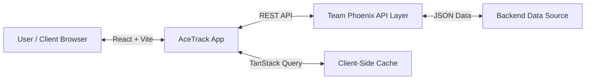

# System Overview

AceTrack is built using a modern **Single Page Application (SPA)** architecture, ensuring high performance and a seamless user experience.

## Architecture Diagram

## 4.7 Complete Flow

1.  **Initialization**: The app boots up using `Vite`. `main.jsx` initializes the `QueryClientProvider` and `ThemeProvider`.
2.  **Route Match**: `react-router-dom` matches the URL (e.g., `/score` or `/rankings`) and renders the appropriate page layout.
3.  **Data Fetching**: Components (like `ScorePage` or `RankingsTable`) call custom hooks (e.g., `useQuery`).
4.  **API Communication**: `apiService.js` makes Axios requests to the configured `VITE_API_BASE_URL`.
5.  **State Update**: Data is cached and the UI updates from "Loading" (Skeleton) to "Success" (Live Data).
